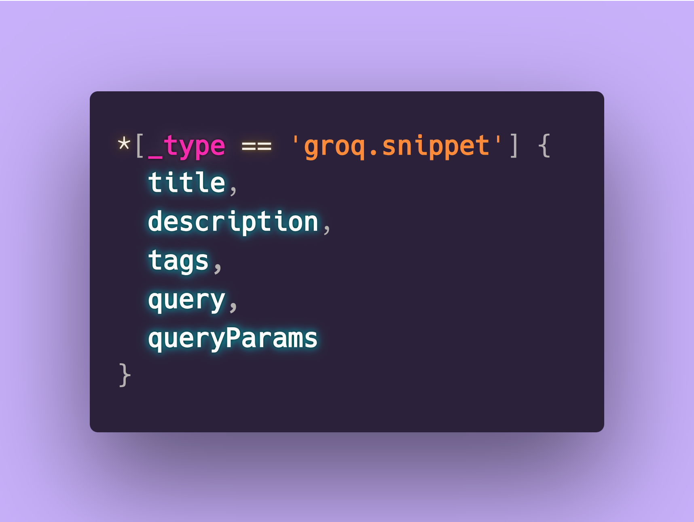
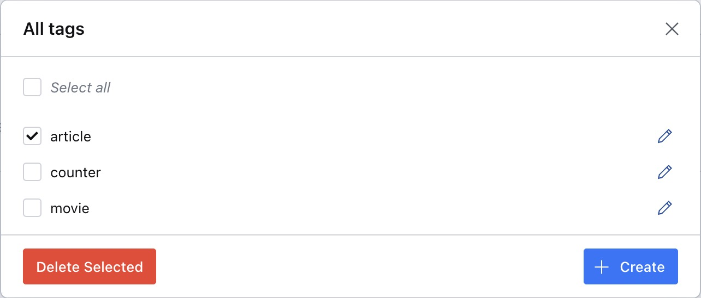
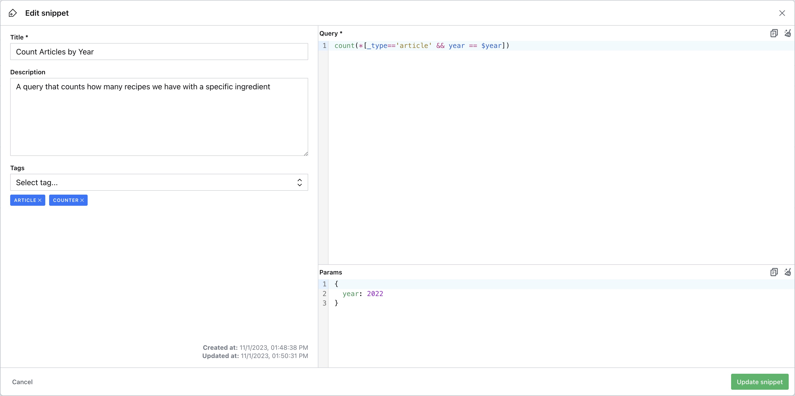

# Sanity Groq Snippet

<p align="center">
  
  <!--  -->
</p>

A Sanity plugin that lets you store and have quick access to frequently used or complex GROQ queries within your Sanity Studio.

- [⚡️ Features](#%EF%B8%8F-features)
- [🔌 Installation](#-installation)
- [🧑‍💻 Usage](#-usage)
- [⚙️ Plugin Configuration](#%EF%B8%8F-plugin-configuration)
- [🏷️ Manage tags](#%EF%B8%8F-manage-tags)
- [🧩 Manage snippets](#-manage-snippets)
- [🗃️ Data Model](#%EF%B8%8F-data-model)
- [🛣️ Roadmap](#%EF%B8%8F-roadmap)
- [📝 License](#-license)
- [🧪 Develop & test](#-develop--test)

<br /><br />

## ⚡️ Features

- Sanity v3 plugin
- Store your groq queries within the Sanity Studio
- Use tags to mark your queries

<br /><br />

## 🔌 Installation

```sh
npm install sanity-plugin-groq-snippet
```

<br /><br />

## 🧑‍💻 Usage

Add it as a plugin in `sanity.config.ts` (or .js):

```ts
import {defineConfig} from 'sanity'
import {GroqSnippetPlugin} from 'sanity-plugin-groq-snippet'

export default defineConfig({
  //...
  plugins: [
    GroqSnippetPlugin({
      // your optional configuration here
    }),
  ],
  // ...
})
```

The plugin introduces one new tool at the top of your Studio navigation. It uses two new documents: `groq.snippet` and `groq.snippet.tag`

<br /><br />

## ⚙️ Plugin Configuration

This is the main configuration of the plugin/tool. The available options are:

```ts
{
  // You can change the name of tool, this will affect also the path of the tool.
  name?: string
  // Customize the icon of the tool with a custom component.
  icon?: ComponentType
  // This option shows the documents used by the tool within the Structure Builder. The tool will use only published documents.
  showDocuments?: boolean
  // You can define a list of roles for which this tool is not in view only mode. The '!' operator allows you to specify the opposite condition.
  editableFor?: string[]
}
```

<br /><br />

## 🏷️ Manage tags

Tags allow you to categorize your queries under a specific topics. You can manage them via the dedicated call-to-action in the top-right corner.

<p align="center">
  
  <!--  -->
</p>

<br /><br />

## 🧩 Manage snippets

A snippet is composed by the following fields:

- **Title**: Represents the name of the snippet and is mandatory.
- **Description**: You can add a short description of your snippet. It will also be visible in the results list.
- **Tags**: You can associate multiple tags with your query. This could be useful for filtering results by a specific tag.
- **Query**: This is the other mandatory field for a snippet and contains your GROQ query.
- **Query Params**: You can also store parameters within your snippet in a JSON format.

<p align="center">
  
  <!--  -->
</p>

<br /><br />

## 🗃️ Data model

```ts
  {
    _type: 'groq.snippet',
    title: string
    description?: string
    tags: 'groq.snippet.tag'[]
    query: text
    queryParams?: text
  }
```

```ts
  {
    _type: 'groq.snippet.tag',
    name: slug
  }
```

<br /><br />

## 🛣️ Roadmap

- Pagination
- 🤔 Export to CSV/PDF?
- 🤔 CSV Import?
- 🤔

<br /><br />

## 📝 License

[MIT](LICENSE) © William Iommi

<br /><br />

## 🧪 Develop & test

This plugin uses [@sanity/plugin-kit](https://github.com/sanity-io/plugin-kit)
with default configuration for build & watch scripts.

See [Testing a plugin in Sanity Studio](https://github.com/sanity-io/plugin-kit#testing-a-plugin-in-sanity-studio)
on how to run this plugin with hotreload in the studio.

### Release new version

Run ["CI & Release" workflow](https://github.com/williamiommi/sanity-plugin-i18n-fields/actions/workflows/main.yml).
Make sure to select the main branch and check "Release new version".

Semantic release will only release on configured branches, so it is safe to run release on any branch.
